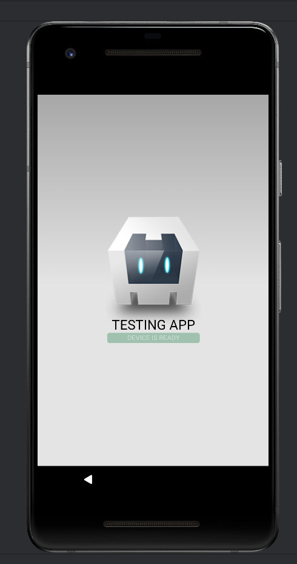

### cordova-plugin-kiosk-device-owner

This plugin provides functionality for managing kiosk mode on Android devices. It allows developers to enable and
disable kiosk mode, as well as configure various device management parameters. This package is useful for developers
creating applications for specialized devices, such as self-service terminals or devices for educational institutions.

### USAGE

Firstly

```shell
adb shell dpm set-device-owner your.app.package/io.github.gallyamow.kiosk_plugin.KioskDeviceAdminReceiver
# example for app with package io.github.gallyamow.testapp
adb shell dpm set-device-owner io.github.gallyamow.testapp/io.github.gallyamow.kiosk_plugin.KioskDeviceAdminReceiver
```

```js
function onDeviceReady () {
  //call to lock
  KioskMode.lock(success => console.log(success), err => console.log(err));

  // call to unlock
  KioskMode.unlock(success => console.log(success), err => console.log(err));
}
```

There are some additional options, see KioskOptions.

After locking, you should see something like



### DEVELOPMENT

To simplify development, you can install the plugin into your application as a symbolic link.

```shell
cordova plugin add ../cordova-plugin-kiosk-device-owner/ --link
```

### SEE

* https://developer.android.com/work/dpc/dedicated-devices/lock-task-mode
* https://cordova.apache.org/docs/en/11.x/guide/hybrid/plugins/
* https://snow.dog/blog/kiosk-mode-android
* https://developer.android.com/reference/android/app/admin/DevicePolicyManager#java
* https://developer.android.com/guide/topics/admin/device-admin.html
* https://xakep.ru/2013/01/22/59980/